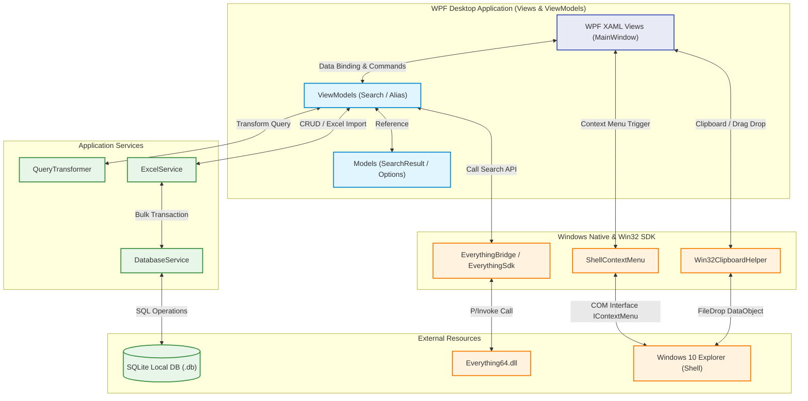

# 🌌 Everything FastAlias: Project Overview

## 1. 정의

**Everything FastAlias**는 Windows 환경의 초고속 파일 검색 도구인 `Everything.exe` 엔진을 P/Invoke FFI(Foreign Function Interface)를 통해 연동하고, 사용자 정의 **'동의어/다국어/별칭(Alias) 매핑'** 테이블을 결합하여 맞춤형 파일 탐색 환경을 제공하는 C# .NET 9.0 WPF 데스크톱 애플리케이션입니다.

- **문제 정의**: 기존 Everything은 파일명에 포함된 단어를 정확히 검색해야 하지만, 한글/영어 혼용 또는 별칭(예: "사과"와 "apple")으로 검색하고 싶을 때 매번 모든 검색어를 OR(`|`) 문법으로 타이핑해야 하는 불편함이 있습니다.
- **해결 방안**: 사용자가 지정한 동의어 그룹(예: `사과`, `apple`, `🍎`)을 내부 SQLite 데이터베이스에 저장해두고, 사용자가 검색창에 "사과"를 입력하면 자동으로 `<사과|apple|🍎>` 형태의 Everything 검색 쿼리로 변환 및 치환하여 `everything64.dll`을 호출합니다. 이를 통해 한 번의 입력으로 연관된 모든 파일을 즉각 찾아냅니다.
- **네이티브 OS 연동성 극대화**:
  - **드래그 아웃**: 검색 리스트 뷰에서 외부 탐색기(Directory Opus, Windows Explorer 등)나 메신저 창으로 파일을 마우스 드래그 앤 드롭(Drag and Drop)하여 복사/이동 지원.
  - **클립보드 네이티브 연동**: Ctrl+C/Ctrl+X 단축키를 통해 검색된 파일을 실제 파일 객체(FileDrop 형식)로 클립보드에 복사/잘라내기하여 윈도우 탐색기에서 붙여넣기 지원.
  - **네이티브 우클릭 쉘 메뉴**: 리스트 뷰 우클릭 시 Windows 10 탐색기에서 쓰이는 기본 우클릭 메뉴(`IContextMenu`)를 팝업으로 노출하여 7-Zip 압축, 연결 프로그램 등의 쉘 기능을 그대로 공유.
- **주요 기능**:
  - 사용자 검색 조건의 실시간 Everything 문법 변환 (FastAlias 스위치 제어)
  - `.xlsx` 엑셀 파일 대량 업로드 및 실시간 CRUD를 지원하는 단어 매핑 관리 UI
  - VirtualizingStackPanel / VirtualizingWrapPanel을 적용하여 수십만 건의 검색 행에도 프레임 드랍이 없는 고속 데이터 테이블 및 섬네일 뷰
  - 9가지 검색 세부 필터 (대소문자, 전체 단어 일치, 정규식, 휴지통 제외, 확장자, 파일 크기 등) 제어

---

## 2. 기술 스택 (Tech Stack)

- **Backend / Desktop Shell**: C# .NET 9.0 (WPF 데스크톱 애플리케이션)
- **UI / Theme Framework**: ModernWPF (Windows 11 스타일 WinUI 테마)
- **MVVM Framework**: CommunityToolkit.Mvvm (ObservableObject, RelayCommand 모델 지원)
- **Native DLL Binding**: P/Invoke (`DllImport` 기반 `everything64.dll` FFI 연동)
- **Database**: Microsoft.Data.Sqlite (고성능 ADO.NET SQLite 클라이언트)
- **Excel Parser**: ExcelDataReader (경량 및 고속 `.xlsx` 파일 파서)
- **Icons**: Lucide.Wpf
- **Virtualization Engine**: VirtualizingWrapPanel (대량의 썸네일 카드 뷰 고속 렌더링 및 픽셀 스크롤링 지원)

---

## 3. 프로젝트 구조

### 3.1. 폴더 및 파일 트리 구조

<!-- START_TREE -->
```text
📂 Everything검색기
├── 📁 docs/                                      # 프로젝트 문서 보관 폴더
│   └── 📁 memories/                              # 핵심 메모리 및 개요 보관 폴더
│       ├── 📄 app_audit_report.md
│       ├── 📄 deepwiki_repos.md
│       ├── 📄 everything_sdk.md
│       ├── 📄 MEMORY.md                          # 지식 자산화 로그
│       ├── 📄 overview.md                        # 본 개요 문서
│       ├── 📄 scripts_guide.md                   # 스크립트 가이드 및 색인 문서
│       └── 📄 wpf_coding_guidelines.md
├── 📁 scripts/                                   # 보조 분석 및 자동화 스크립트 폴더 (상세: docs/memories/scripts_guide.md)
├── 📁 src/                                       # 메인 소스코드 폴더
│   ├── 📁 EverythingFastAlias/
│   │   ├── 📁 Assets/
│   │   │   ├── 📁 dll/
│   │   │   │   └── 📄 Everything64.dll
│   │   │   └── 📄 app_icon.ico
│   │   ├── 📁 Config/
│   │   │   ├── 📄 AppConstants.cs                # IPC 및 시스템 제어용 상수
│   │   │   ├── 📄 RangeObservableCollection.cs
│   │   │   └── 📄 UIConstants.cs                 # UI 크기 및 기본 핫키 설정
│   │   ├── 📁 Converters/
│   │   │   ├── 📄 BoolToVisibilityConverter.cs   # Bool → Visibility 전역 변환 서비스
│   │   │   └── 📄 HighlightBehavior.cs
│   │   ├── 📁 Models/
│   │   │   ├── 📄 AliasMapping.cs                # MVVM 바인딩용 매핑 정보 모델
│   │   │   ├── 📄 DriveOptionItem.cs
│   │   │   ├── 📄 SearchOptions.cs               # 9가지 검색 조건 옵션 모델
│   │   │   ├── 📄 SearchResultItem.cs            # 검색 행 데이터 모델 ( display size 및 날짜 자동 가공 )
│   │   │   └── 📄 ViewMode.cs                    # 보기 모드(자세히/섬네일S/M/L) 설정을 위한 열거형
│   │   ├── 📁 Native/
│   │   │   ├── 📄 EverythingBridge.cs            # Everything 엔진 상태 점검 및 검색 질의 래핑
│   │   │   ├── 📄 EverythingSdk.cs               # kernel32.dll LoadLibrary 기반 FFI 및 P/Invoke
│   │   │   ├── 📄 ShellContextMenu.cs            # COM 인터페이스 마샬링 기반 윈도우 네이티브 우클릭 메뉴 팝업
│   │   │   ├── 📄 ShellIconHelper.cs             # 시스템 기본 폴더/파일 아이콘 캐시 헬퍼
│   │   │   ├── 📄 ShellThumbnailHelper.cs        # IShellItemImageFactory FFI 기반 썸네일 고화질 추출기
│   │   │   ├── 📄 TrayIconHelper.cs              # System.Windows.Forms.NotifyIcon 기반 시스템 트레이 아이콘 전담
│   │   │   ├── 📄 Win32ClipboardHelper.cs        # 파일 클립보드 복사/잘라내기 네이티브 래퍼
│   │   │   ├── 📄 Win32FileOperationHelper.cs    # SHFileOperation FFI 기반 복사/이동 헬퍼
│   │   │   └── 📄 Win32RecycleBinHelper.cs       # SHFileOperation FFI 기반 휴지통 삭제 헬퍼
│   │   ├── 📁 Properties/
│   │   │   └── 📁 PublishProfiles/
│   │   ├── 📁 Services/
│   │   │   ├── 📄 AutoStartService.cs            # 시작프로그램 자동 실행 등록/해제 관리 서비스
│   │   │   ├── 📄 DatabaseService.cs             # SQLite 연결 싱글톤 및 Bulk Save 트랜잭션 구문
│   │   │   ├── 📄 ExcelService.cs                # ExcelDataReader 기반 고속 파싱
│   │   │   └── 📄 QueryTransformer.cs            # 동의어 치환 및 Everything 공식 문법 최종 변환 서비스
│   │   ├── 📁 ViewModels/
│   │   │   ├── 📄 AliasManagerViewModel.cs       # 매핑 데이터 CRUD 및 엑셀 파싱 조율
│   │   │   ├── 📄 MainWindowViewModel.cs         # 메인 레이아웃 및 윈도우 생성 이벤트 중계
│   │   │   ├── 📄 SearchViewModel.cs             # 실시간 검색 뷰모델 (필드, 기본 속성 및 UI 바인딩 래퍼) [PARTIAL]
│   │   │   ├── 📄 SearchViewModel.Search.cs      # 실시간 검색 실행 및 결과 정렬 로직 [PARTIAL]
│   │   │   └── 📄 SearchViewModel.Settings.cs    # 사용자 설정 저장/로드 및 드라이브 초기화 로직 [PARTIAL]
│   │   ├── 📁 Views/
│   │   │   ├── 📁 Components/
│   │   │   ├── 📁 Modals/
│   │   │   │   ├── 📄 AliasManagerWindow.xaml
│   │   │   │   ├── 📄 AliasManagerWindow.xaml.cs
│   │   │   │   ├── 📄 HelpWindow.xaml
│   │   │   │   └── 📄 HelpWindow.xaml.cs
│   │   │   ├── 📄 LeftSidebarView.xaml           # 좌측 스마트 컨트롤 패널 (UniformGrid, WrapPanel)
│   │   │   ├── 📄 LeftSidebarView.xaml.cs        # 크기 필터 리셋 트리거
│   │   │   ├── 📄 MainWindow.xaml                # 메인 윈도우 UI (3:7 Grid Splitter)
│   │   │   ├── 📄 MainWindow.xaml.cs             # 모달 호출 및 엔진 미구동 감지 시 자동 시작 핸들러
│   │   │   ├── 📄 ResultGridView.xaml            # 우측 파일 데이터 가상화 리스트뷰
│   │   │   └── 📄 ResultGridView.xaml.cs         # Drag-out 마운트, 네이티브 ContextMenu 팝업, Ctrl+C/X 단축키 감지
│   │   ├── 📄 App.xaml                           # ModernWpfUI 테마 리소스 병합
│   │   ├── 📄 App.xaml.cs
│   │   ├── 📄 AssemblyInfo.cs
│   │   └── 📄 EverythingFastAlias.csproj         # NuGet 패키지 및 Native DLL 복사 빌드 규칙 지정
│   ├── 📁 EverythingFastAlias.Tests/
│   │   ├── 📄 EverythingFastAlias.Tests.csproj
│   │   ├── 📄 MSTestSettings.cs
│   │   └── 📄 QueryTransformerTest.cs
│   ├── 📁 TempRunner/
│   │   ├── 📄 Program.cs
│   │   └── 📄 TempRunner.csproj
│   ├── 📄 EverythingFastAlias.slnx
│   └── 📄 test_transform.cs
├── 📄 build-debug.bat
└── 📄 build-release.bat

# (Note) 에이전트의 토큰 절약을 위해 주요 파일만 선별하여 표시하고 있습니다.
```
<!-- END_TREE -->

### 3.2. 주요 폴더 및 파일 역할

#### 📁 `docs/memories/` (핵심 메모리 및 도메인 지식)
- `overview.md`: 본 개요 문서
- `MEMORY.md`: 지식 자산화 로그
- `scripts_guide.md`: `scripts/` 폴더 내 모든 자동화 도구, 테스트 스위트, 빌드 유틸리티 색인 및 실행 가이드
- `everything_sdk.md`: Everything SDK 연동, 마샬링 및 Windows Context Menu 연동 전문 지식
- `wpf_coding_guidelines.md`: WPF 테마 호환, MVVM 아키텍처 및 대용량 가상화 렌더링 지침

#### 📁 `src/EverythingFastAlias/Models/` (데이터 도메인)
- `SearchResultItem.cs`: Everything SDK로부터 수신한 개별 파일/폴더 정보(이름, 경로, 크기, 수정일 등)를 저장하며, 비동기 지연 로딩 썸네일 속성 탑재.
- `SearchOptions.cs`: 정규식, 대소문자, 전체단어, 미디어 필터 등 9가지 검색 스위치 옵션 상태값 보유.
- `AliasMapping.cs`: SQLite DB와 MVVM UI 간 바인딩되는 동의어 매핑 도메인 모델.
- `ViewMode.cs`: 보기 형태(자세히/섬네일S/M/L) 설정을 위한 도메인 열거형.

#### 📁 `src/EverythingFastAlias/ViewModels/` (비즈니스 로직 및 상태 관리)
- `MainWindowViewModel.cs`: 메인 화면의 레이아웃 상태(리사이저, 모달 활성화) 제어 및 전역 Command 매핑.
- `SearchViewModel.cs` (Partial): 검색 키워드 바인딩, 미디어/크기 옵션 전이 제어 등 UI 전용 래퍼 속성을 보유하는 메인 뷰모델 선언부.
- `SearchViewModel.Search.cs` (Partial): 비동기 백그라운드 검색 실행(Task.Run), 디바운싱 타이머 제어, 결과 정렬(SortResults) 등 검색 연동 핵심 로직 전담.
- `SearchViewModel.Settings.cs` (Partial): 검색 필터, 타겟 드라이브 및 보기 옵션(ViewMode) 설정값의 SQLite 영속성 관리(Load/SaveSettings), PC의 물리 고정 드라이브 감지 및 초기화(Reset) 전담.
- `AliasManagerViewModel.cs`: SQLite와 연동되어 매핑 테이블의 실시간 추가/수정/삭제 관리 및 엑셀 대용량 임포트 제어.

#### 📁 `src/EverythingFastAlias/Views/` (UI 마크업 레이어)
- `ResultGridView.xaml`: `VirtualizingWrapPanel` 및 `VirtualizingPanel.IsVirtualizing="True"`를 결합하여 썸네일 바둑판 가상 스크롤 렌더링 최적화. 컬럼 드래그 순서 변경(Reorder), 정렬 방향 화살표 탑재, F2 인라인 이름변경 지원.
- `LeftSidebarView.xaml`: 아코디언 형태의 조건 필터들과 다중 선택 프리셋 미디어 칩, 보기 옵션 전환 라디오 버튼 그룹 및 상단 초기화 버튼 배치.
- `MainWindow.xaml`: 3:7 Grid Splitter 레이아웃 기반 메인 프레임워크 및 트레이 아이콘 이벤트 라우팅.

#### 📁 `src/EverythingFastAlias/Native/` & `Services/` (네이티브 FFI 및 가공 서비스)
- `EverythingSdk.cs`: `wchar_t*` Unicode API 함수(`Everything_SetSearchW` 등) 정의.
- `ShellContextMenu.cs`: 파일들의 전체 경로 목록을 윈도우 OS의 `IContextMenu` 및 `SHGetContextMenu` API에 연동하여 네이티브 우클릭 메뉴 팝업 트리거.
- `Win32RecycleBinHelper.cs`: `SHFileOperation` API를 활용하여 경고창 없이 무확인으로 파일을 안전하게 휴지통으로 제거하는 전담 헬퍼.
- `Win32FileOperationHelper.cs`: `SHFileOperation` API를 활용하여 외부 드롭 시 윈도우 표준 진행창을 노출하며 파일 복사/이동을 수행하는 전담 헬퍼.
- `ShellIconHelper.cs`: 시스템 기본 파일 및 폴더 아이콘 추출 및 Freeze 메모리 캐시 전담.
- `ShellThumbnailHelper.cs`: `IShellItemImageFactory` 기반의 파일 썸네일 비동기 디스크 추출 및 GDI 메모리 환수 전담.
- `QueryTransformer.cs`: 입력어 분석 후 중괄호가 아닌 부등호 `< >`와 OR 연산자(`|`)를 기반으로 동의어들을 가공하고, 사용자가 입력한 고유 제약조건/드라이브를 보존하며, 정규식 옵션 시 개별 토큰에 regex: 수식어를 즉시 래핑하여 문법 충돌 없이 Everything 공식 문법으로 최종 변환하는 서비스.

### 3.3. 기술 아키텍처



---

## 4. 개발 및 디버깅 워크플로우

- **overview.md 트리 동기화**:
  ```powershell
  python scripts/dev_tools/overview_tree.py
  ```
  *(💡 `overview_tree.py` 실행 타이밍: 턴마다 불필요하게 호출하지 않으며, 사용자가 명시적으로 지시하거나 작업 완료 후 최종 단계에서 1회 정밀 실행합니다.)*

- **MEMORY.md 기록 작성**:
  ```powershell
  @'
  {
    "title": "Title here...",
    "context": "Context & Goal here...",
    "solution": "Verified Solution here...",
    "anti_patterns": "Anti-Patterns & Root Cause here..."
  }
  '@ | python scripts/dev_tools/memory_log.py --stdin
  ```

- **빌드 및 실행**:
  - 디버그 빌드: `dotnet build src/EverythingFastAlias/EverythingFastAlias.csproj -c Debug`
  - 릴리즈 빌드: `dotnet build src/EverythingFastAlias/EverythingFastAlias.csproj -c Release`
  - 단위 테스트: `dotnet test src/EverythingFastAlias.Tests/EverythingFastAlias.Tests.csproj`
