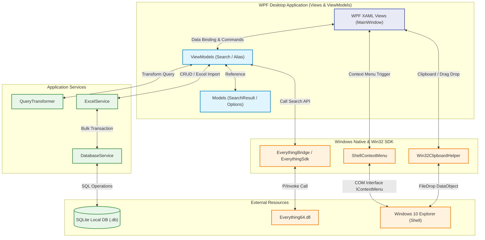

# Everything FastAlias 프로젝트 개요 (C# WPF)

## 1. 워크스페이스의 목적

**Everything FastAlias**는 Windows 환경의 초고속 파일 검색 도구인 `Everything.exe` 엔진을 P/Invoke FFI(Foreign Function Interface)를 통해 연동하고, 사용자 정의 **'동의어/다국어/별칭(Alias) 매핑'** 테이블을 결합하여 맞춤형 파일 탐색 환경을 제공하는 C# .NET 9.0 WPF 데스크톱 애플리케이션입니다.

- **문제 정의**: 기존 Everything은 파일명에 포함된 단어를 정확히 검색해야 하지만, 한글/영어 혼용 또는 별칭(예: "사과"와 "apple")으로 검색하고 싶을 때 매번 모든 검색어를 OR(`|`) 문법으로 타이핑해야 하는 불편함이 있습니다.
- **해결 방안**: 사용자가 지정한 동의어 그룹(예: `사과`, `apple`, `🍎`)을 내부 SQLite 데이터베이스에 저장해두고, 사용자가 검색창에 "사과"를 입력하면 자동으로 `<사과|apple|🍎>` 형태의 Everything 검색 쿼리로 변환 및 치환하여 `everything64.dll`을 호출합니다. 이를 통해 한 번의 입력으로 연관된 모든 파일을 즉각 찾아냅니다.
- **네이티브 OS 연동성 극대화**:
  - **드래그 아웃**: 검색 리스트 뷰에서 외부 탐색기(Directory Opus, Windows Explorer 등)나 메신저 창으로 파일을 마우스 드래그 앤 드롭(Drag and Drop)하여 복사/이동 지원.
  - **클립보드 네이티브 연동**: Ctrl+C/Ctrl+X 단축키를 통해 검색된 파일을 실제 파일 객체(FileDrop 형식)로 클립보드에 복사/잘라내기하여 윈도우 탐색기에서 붙여넣기 지원.
  - **네이티브 우클릭 쉘 메뉴**: 리스트 뷰 우클릭 시 Windows 10 탐색기에서 쓰이는 기본 우클릭 메뉴(`IContextMenu`)를 팝업으로 노출하여 7-Zip 압축, 연결 프로그램 등의 쉘 기능을 그대로 공유.
- **주요 기능**:
  - 사용자 검색 조건의 실시간 Everything 문법 변환 (FastAlias 스위치 제어)
  - `.xlsx` 엑셀 파일 대량 업로드 및 실시간 CRUD를 지원하는 단어 매핑 관리 UI
  - VirtualizingStackPanel을 적용하여 수십만 건의 검색 행에도 프레임 드랍이 없는 고속 데이터 테이블 뷰
  - 9가지 검색 세부 필터 (대소문자, 전체 단어 일치, 정규식, 휴지통 제외, 확장자, 파일 크기 등) 제어

---

## 2. 기술 스택

### 개발 환경 및 런타임

- **런타임 및 데스크톱 쉘**: C# .NET 9.0 (WPF 데스크톱 애플리케이션)
- **UI 및 테마 라이브러리**: ModernWPF (Windows 11 스타일의 깔끔한 WinUI UI 적용)
- **MVVM 프레임워크**: CommunityToolkit.Mvvm (ObservableObject, RelayCommand 모델 지원)
- **네이티브 DLL 바인딩**: P/Invoke (`DllImport`를 사용한 `everything64.dll` 연동)
- **로컬 데이터베이스**: Microsoft.Data.Sqlite (고성능 ADO.NET 클라이언트 라이브러리)
- **Excel 파서**: ExcelDataReader (경량 및 고속 `.xlsx` 파일 파서)
- **아이콘**: Lucide.Wpf
- **바둑판 뷰 가상화**: VirtualizingWrapPanel (대량의 썸네일 카드 뷰 고속 렌더링 및 픽셀 스크롤링 지원)

---

## 3. 프로젝트 구조

### 3.1. 폴더 및 파일 트리 구조

```text
D:\3_Code\3_Apps\43_Search-Edit\Everything검색기\
├── .gitignore
├── docs/
├── .codegraph/
└── src/
    └── EverythingFastAlias/
```

```text
D:\3_Code\3_Apps\43_Search-Edit\Everything검색기\src\EverythingFastAlias\
├── App.xaml                   # ModernWpfUI 테마 리소스 병합
├── App.xaml.cs
├── EverythingFastAlias.csproj # NuGet 패키지 및 Native DLL 복사 빌드 규칙 지정
├── Config/
│   ├── AppConstants.cs        # IPC 및 시스템 제어용 상수
│   └── UIConstants.cs         # UI 크기 및 기본 핫키 설정
├── Models/
│   ├── SearchResultItem.cs    # 검색 행 데이터 모델 ( display size 및 날짜 자동 가공 )
│   ├── SearchOptions.cs       # 9가지 검색 조건 옵션 모델
│   ├── AliasMapping.cs        # MVVM 바인딩용 매핑 정보 모델
│   └── ViewMode.cs            # 보기 모드(자세히/섬네일S/M/L) 설정을 위한 열거형 [NEW]
├── ViewModels/
│   ├── MainWindowViewModel.cs # 메인 레이아웃 및 윈도우 생성 이벤트 중계
│   ├── SearchViewModel.cs     # 실시간 검색 뷰모델 (필드, 기본 속성 및 UI 바인딩 래퍼) [PARTIAL]
│   ├── SearchViewModel.Search.cs # 실시간 검색 실행 및 결과 정렬 로직 [PARTIAL]
│   ├── SearchViewModel.Settings.cs # 사용자 설정 저장/로드 및 드라이브 초기화 로직 [PARTIAL]
│   └── AliasManagerViewModel.cs # 매핑 데이터 CRUD 및 엑셀 파싱 조율
├── Views/
│   ├── MainWindow.xaml        # 메인 윈도우 UI (3:7 Grid Splitter)
│   ├── MainWindow.xaml.cs     # 모달 호출 및 엔진 미구동 감지 시 자동 시작 핸들러
│   ├── LeftSidebarView.xaml   # 좌측 스마트 컨트롤 패널 (UniformGrid, WrapPanel)
│   ├── LeftSidebarView.xaml.cs # 크기 필터 리셋 트리거
│   ├── ResultGridView.xaml    # 우측 파일 데이터 가상화 리스트뷰
│   └── ResultGridView.xaml.cs # Drag-out 마운트, 네이티브 ContextMenu 팝업, Ctrl+C/X 단축키 감지
├── Native/
│   ├── EverythingSdk.cs       # kernel32.dll LoadLibrary 기반 FFI 및 P/Invoke
│   ├── EverythingBridge.cs    # Everything 엔진 상태 점검 및 검색 질의 래핑
│   ├── Win32ClipboardHelper.cs # 파일 클립보드 복사/잘라내기 네이티브 래퍼
│   ├── Win32RecycleBinHelper.cs # SHFileOperation FFI 기반 휴지통 삭제 헬퍼 [NEW]
│   ├── Win32FileOperationHelper.cs # SHFileOperation FFI 기반 복사/이동 헬퍼 [NEW]
│   ├── ShellContextMenu.cs    # COM 인터페이스 마샬링 기반 윈도우 네이티브 우클릭 메뉴 팝업
│   ├── ShellIconHelper.cs     # 시스템 기본 폴더/파일 아이콘 캐시 헬퍼 [NEW]
│   ├── ShellThumbnailHelper.cs # IShellItemImageFactory FFI 기반 썸네일 고화질 추출기 [NEW]
│   └── TrayIconHelper.cs      # System.Windows.Forms.NotifyIcon 기반 시스템 트레이 아이콘 전담
└── Services/
    ├── QueryTransformer.cs    # 동의어 치환 및 Everything 공식 문법 최종 변환 서비스
    ├── ExcelService.cs        # ExcelDataReader 기반 고속 파싱
    ├── DatabaseService.cs     # SQLite 연결 싱글톤 및 Bulk Save 트랜잭션 구문
    └── AutoStartService.cs    # 시작프로그램 자동 실행 등록/해제 관리 서비스
└── Converters/
    └── BoolToVisibilityConverter.cs # Bool → Visibility 전역 변환 서비스
```

### 3.2. 폴더 및 파일 역할

#### Models (데이터 도메인)

- **`SearchResultItem.cs`**: Everything SDK로부터 수신한 개별 파일/폴더 정보(이름, 경로, 크기, 수정일 등)를 저장하며, 비동기 지연 로딩 썸네일 속성 탑재.
- **`SearchOptions.cs`**: 정규식, 대소문자, 전체단어, 미디어 필터 등 9가지 검색 스위치 옵션 상태값 보유.
- **`ViewMode.cs`**: 보기 형태(자세히/섬네일S/M/L) 설정을 위한 도메인 열거형.

#### ViewModels (비즈니스 로직 및 상태 관리)

- **`MainWindowViewModel.cs`**: 메인 화면의 레이아웃 상태(리사이저, 모달 활성화) 제어 및 전역 Command 매핑.
- **`SearchViewModel.cs` (Partial)**: 검색 키워드 바인딩, 미디어/크기 옵션 전이 제어 등 UI 전용 래퍼 속성을 보유하는 메인 뷰모델 선언부.
- **`SearchViewModel.Search.cs` (Partial)**: 비동기 백그라운드 검색 실행(Task.Run), 디바운싱 타이머 제어, 결과 정렬(SortResults) 등 검색 연동 핵심 로직 전담.
- **`SearchViewModel.Settings.cs` (Partial)**: 검색 필터, 타겟 드라이브 및 보기 옵션(ViewMode) 설정값의 SQLite 영속성 관리(Load/SaveSettings), PC의 물리 고정 드라이브 감지 및 초기화(Reset) 전담.
- **`AliasManagerViewModel.cs`**: SQLite와 연동되어 매핑 테이블의 실시간 추가/수정/삭제 관리 및 엑셀 대용량 임포트 제어.

#### Views (UI 마크업 레이어)

- **`ResultGridView.xaml`**: `VirtualizingWrapPanel` 및 `VirtualizingPanel.IsVirtualizing="True"`를 결합하여 썸네일 바둑판 가상 스크롤 렌더링 최적화. 컬럼 드래그 순서 변경(Reorder), 정렬 방향 화살표 탑재, F2 인라인 이름변경 지원.
- **`LeftSidebarView.xaml`**: 아코디언 형태의 조건 필터들과 다중 선택 프리셋 미디어 칩, 보기 옵션 전환 라디오 버튼 그룹 및 상단 초기화 버튼 배치.

#### Native & Services (네이티브 FFI 및 가공 서비스)

- **`EverythingSdk.cs`**: `wchar_t*` Unicode API 함수(`Everything_SetSearchW` 등) 정의.
- **`ShellContextMenu.cs`**: 파일들의 전체 경로 목록을 윈도우 OS의 `IContextMenu` 및 `SHGetContextMenu` API에 연동하여 네이티브 우클릭 메뉴 팝업 트리거.
- **`Win32RecycleBinHelper.cs`**: `SHFileOperation` API를 활용하여 경고창 없이 무확인으로 파일을 안전하게 휴지통으로 제거하는 전담 헬퍼. [NEW]
- **`Win32FileOperationHelper.cs`**: `SHFileOperation` API를 활용하여 외부 드롭 시 윈도우 표준 진행창을 노출하며 파일 복사/이동을 수행하는 전담 헬퍼. [NEW]
- **`ShellIconHelper.cs`**: 시스템 기본 파일 및 폴더 아이콘 추출 및 Freeze 메모리 캐시 전담.
- **`ShellThumbnailHelper.cs`**: `IShellItemImageFactory` 기반의 파일 썸네일 비동기 디스크 추출 및 GDI 메모리 환수 전담.
- **`QueryTransformer.cs`**: 입력어 분석 후 중괄호가 아닌 부등호 `< >`와 OR 연산자(`|`)를 기반으로 동의어들을 가공하고, 사용자가 입력한 고유 제약조건/드라이브를 보존하며, 정규식 옵션 시 개별 토큰에 regex: 수식어를 즉시 래핑하여 문법 충돌 없이 Everything 공식 문법으로 최종 변환하는 서비스.

#### 📂 기술 도메인별 세부 지식 자산 링크 (Knowledge Bases)

### 🔗 [Everything SDK & Windows Shell Integration](file:///d:/3_Code/3_Apps/43_Search-Edit/Everything%EA%B2%80%EC%83%89%EA%B8%B0/docs/memories/everything_sdk.md)

Everything SDK 연동, 바인딩 마샬링, 대용량 FFI 쿼리 단축 및 Windows Context Menu 연동과 관련된 모든 전문 지식이 요약되어 있습니다.

- `wchar_t*` 기반 Unicode API 사용 규칙
- `BOOL` 마샬링 크래시 방지 및 `Everything_GetLastError` 진입점 바인딩
- 수십만 건 대량 쿼리 및 빈 검색어 단락 회로(Short-circuit) 최적화
- `IContextMenu2/3` Owner Draw 메시지 후킹 및 서브메뉴 렌더링 해결

### 🔗 [WPF & Code Architecture Guidelines](file:///d:/3_Code/3_Apps/43_Search-Edit/Everything%EA%B2%80%EC%83%89%EA%B8%B0/docs/memories/wpf_coding_guidelines.md)

WPF 프레임워크 제어, UI 컴포넌트 커스터마이징, 빌드 충돌 해결 및 대용량 연관어 매핑 검색과 관련된 코딩 레벨의 노하우가 수록되어 있습니다.

- ModernWpf 테마 로딩 예외 방지 및 XAML 호환 해결법
- Windows Forms FFI 명칭 충돌(global using) 차단
- 다중 창 기동 시 트레이 아이콘 생명주기 관리
- 다중 선택 드래그 앤 드롭과 더블클릭 이벤트 간섭 해소 기법
- ObservableCollection 렌더링 병목 및 대용량 사전(Regex) O(1) 캐싱 최적화

### 3.3. 기술 아키텍처



---

## 4. 개발 및 디버깅 워크플로우

1. **사전 준비**: C# .NET 9.0 프로젝트 구조 확립 및 NuGet 패키지 탑재.
2. **백엔드/FFI 구성**: `everything64.dll` 로드 및 프로세스 백그라운드 자동 기동 파이프라인 탑재.
3. **영속성 및 데이터 가공 구현**: SQLite DB 연결 싱글톤 및 QueryTransformer 치환 알고리즘 개발 (단위 테스트 병행).
4. **WPF UI 및 MVVM**: ModernWPF 적용 및 XAML 가상화 리스트뷰 구축. drag-out 및 clipboard 복사/잘라내기 구현.
5. **쉘 메뉴 연동**: `ShellContextMenu`를 구현하여 마우스 우클릭 시 OS 네이티브 팝업 연동.
6. **통합 테스트**: 대량 데이터 리스트 성능 검증, 엑셀 대용량 업로드 트랜잭션 정상 검증.
