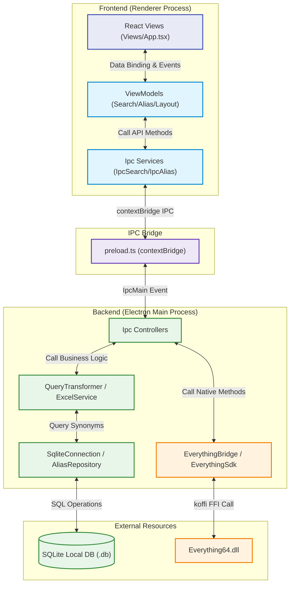

# Everything FastAlias 프로젝트 개요

## 1. 워크스페이스의 목적

**Everything FastAlias**는 Windows 환경의 초고속 파일 검색 도구인 `Everything.exe` 엔진을 FFI(Foreign Function Interface)를 통해 연동하고, 사용자 정의 **'동의어/다국어/별칭(Alias) 매핑'** 테이블을 결합하여 맞춤형 파일 탐색 환경을 제공하는 Electron 기반의 데스크톱 애플리케이션입니다.

- **문제 정의**: 기존 Everything은 파일명에 포함된 단어를 정확히 검색해야 하지만, 한글/영어 혼용 또는 별칭(예: "사과"와 "apple")으로 검색하고 싶을 때 매번 모든 검색어를 OR(`|`) 문법으로 타이핑해야 하는 불편함이 있습니다.
- **해결 방안**: 사용자가 지정한 동의어 그룹(예: `사과`, `apple`, `🍎`)을 내부 SQLite 데이터베이스에 저장해두고, 사용자가 검색창에 "사과"를 입력하면 자동으로 `<사과|apple|🍎>` 형태의 Everything 검색 쿼리로 변환 및 치환하여 `everything64.dll`을 호출합니다. 이를 통해 한 번의 입력으로 연관된 모든 파일을 즉각 찾아냅니다.
- **주요 기능**:
  - 사용자 검색 조건의 실시간 Everything 문법 변환 (FastAlias 스위치 제어)
  - `.xlsx` 엑셀 파일 대량 업로드 및 실시간 CRUD를 지원하는 단어 매핑 관리 UI
  - Virtualized List를 적용하여 수십만 건의 검색 행에도 프레임 드랍이 없는 데이터 그리드 패널
  - 9가지 검색 세부 필터 (대소문자, 전체 단어 일치, 정규식, 휴지통 포함, 확장자, 파일 크기 등) 제어

---

## 2. 기술 스택

### 개발 환경 및 런타임

- **런타임 및 데스크톱 쉘**: Electron (Node.js 20+ 기반)
- **프론트엔드 빌드 도구**: Vite
- **프론트엔드 UI**: React, TypeScript, Tailwind CSS v4, Lucide React (로컬 번들형 아이콘)
- **네이티브 DLL 바인딩**: `koffi` (Win32 API `everything64.dll` 호출 FFI 라이브러리)
- **로컬 데이터베이스**: `better-sqlite3` (임베디드 SQLite3 데이터베이스)
- **엑셀 파서**: `xlsx` (SheetJS)

---

## 3. 프로젝트 구조

### 3.1. 폴더 및 파일 트리 구조

```text
D:\3_Code\3_Apps\43_Search-Edit\Everything검색기\
├── .gitignore
├── package.json
├── vite.config.ts
├── docs/                             # 에이전트 참고용 공식 문서 및 DLL 배치 폴더
│   ├── Everything Offical Manual/
│   │   ├── Everything.exe도움말.txt
│   │   ├── Everything검색문법.txt
│   │   └── Everything정규식문법.txt
│   ├── EverythingDLL/
│   │   └── Everything64.dll
│   └── memories/                     # AI 에이전트 기억 저장소
│       ├── overview.md               # 프로젝트 개요서 (본 파일)
│       └── AGENTS.md                 # 에이전트 작업 이력 및 지식 자산 로그
├── backend/                          # Electron 메인 프로세스 (네이티브 & 데이터 제어)
│   └── src/
│       ├── config/
│       │   └── AppConstants.ts       # 백엔드 상수 (IPC 채널명, DLL 설정, 글로벌 핫키 등)
│       ├── main.ts                   # 앱 엔트리포인트 (Electron 생명주기 및 윈도우 관리)
│       ├── preload.ts                # 안전한 렌더러 IPC 브릿지
│       ├── types/                    # DTO 및 인터페이스 정의 (IAliasDto.ts, ISearchRequest.ts 등)
│       ├── controllers/              # IPC 요청 수신 라우터 (SearchIpcController.ts, AliasIpcController.ts)
│       ├── native/                   # DLL FFI 래퍼 (EverythingSdk.ts, EverythingBridge.ts)
│       ├── service/                  # 비즈니스 로직 (QueryTransformer.ts, ExcelService.ts)
│       ├── database/                 # SQLite 연결 및 세팅 (SqliteConnection.ts)
│       └── repository/               # SQLite CRUD (AliasRepository.ts)
└── frontend/                         # React 렌더러 프로세스 (UI 레이어)
    ├── index.html
    ├── vite.config.ts
    └── src/
        ├── main.tsx                  # React 엔트리포인트
        ├── index.css                 # 스타일시트 (Tailwind v4 및 전역 스타일)
        ├── config/
        │   └── UiConstants.ts        # 프론트엔드 상수 (레이아웃 규격, 로컬 단축키 등)
        ├── types/                    # 프론트엔드 데이터 타입 정의 (ISearchResult.ts, ISearchOptions.ts 등)
        ├── services/                 # Electron Preload IPC 연동 서비스 (IpcSearchService.ts, IpcAliasService.ts)
        ├── components/               # 재사용 원자 컴포넌트 (ToggleChip.tsx, SegmentedControl.tsx 등)
        ├── viewmodels/               # MVVM ViewModel (SearchViewModel.ts, AliasViewModel.ts, LayoutViewModel.ts)
        └── views/                    # UI 뷰 컴포넌트 (App.tsx, layouts/, left/, right/, modals/)
```

### 3.2. 폴더 및 파일 역할

#### Backend (Electron Main Process)

- **`backend/src/main.ts`**: Electron 앱 구동, 브라우저 윈도우 생성, 글로벌 단축키 등록 및 생명주기 제어.
- **`backend/src/preload.ts`**: IPC 채널 통신을 안전하게 렌더러 프로세스에 노출하는 브릿지.
- **`backend/src/controllers/`**: 프론트엔드에서 수신한 IPC 메시지를 알맞은 서비스 레이어로 전달하는 라우터 역할.
- **`backend/src/native/`**: `koffi` FFI를 이용해 `Everything64.dll`의 C API를 바인딩하고, Node.js 친화적인 와이드 캐릭터(UTF-16) 통신을 제공하는 래퍼.
- **`backend/src/service/QueryTransformer.ts`**: 사용자가 입력한 단어를 캐시된 데이터 및 SQLite의 매핑 규칙에 따라 Everything 검색 문법에 알맞게 치환하는 핵심 비즈니스 로직.
- **`backend/src/database/` & `repository/`**: `better-sqlite3`를 사용하여 영속화 레이어를 다루며, 대용량 엑셀 업로드를 고속 처리하기 위해 트랜잭션 구문을 안전하게 캡슐화.

#### Frontend (Vite + React Renderer Process)

- **`frontend/src/viewmodels/`**: React 뷰와 결합되는 상태(State) 및 액션 핸들러를 정의하는 영역. 데이터 가공 및 상태 제어 로직을 뷰와 철저히 분리(Strict SoC).
- **`frontend/src/views/`**: 실제 UI를 표시하는 프리젠테이션 레이어. `1파일 1컴포넌트` 원칙을 고수하여, 사이드바, 검색 그룹, 아코디언, 테이블 뷰를 컴포넌트 단위로 분리.
- **`frontend/src/views/right/ResultTableBody.tsx`**: 수만 개의 검색 결과 행을 빠르게 렌더링하기 위해 Virtualized List 가상 렌더러 기법 적용.

### 3.3. 기술 아키텍처



---

## 4. 개발 및 디버깅 워크플로우

1. **사전 준비 및 환경 세팅**:
   - `Better-sqlite3` 빌드 시 Electron 버전에 종속성을 일치시키기 위해 `electron-rebuild` 파이프라인 작동 보장.
   - 개발 및 배포 환경에 따라 `Everything64.dll`을 동적 경로로 로드하도록 native 계열 클래스 설계.
2. **백엔드 FFI 및 데이터 베이스 기능 구축**:
   - `koffi`를 이용한 DLL 바인딩 검증 및 와이드 캐릭터 문자열(`wchar_t*` 기반 W 함수)을 이용해 다국어 입력 시 한글 깨짐 문제를 완전 방지.
   - SQLite DB 매핑 테이블 설계 및 초기 DDL 생성.
3. **QueryTransformer 구현**:
   - `!<단어>` 형태의 제외 조건, `ext:` 확장자 필터, `parent:`/`infolder:` 직계 하위 검색 등 Everything 오피셜 문법을 기계식으로 가공하는 트랜스포머 알고리즘 개발.
4. **프론트엔드 MVVM 설계**:
   - View와 ViewModel의 철저한 SoC(관심사 분리)를 지키며 컴포넌트를 점진적으로 쪼개어 구성.
   - Virtualized List 기반 테이블 뷰 구현으로 대량 데이터 유입 성능 검증.
5. **통합 및 테스트**:
   - IPC 채널 상수(`AppConstants.ts` & `UiConstants.ts`) 매핑을 활용해 오타 없는 인터페이스 연결 및 시나리오별 작동 테스트 수행.
